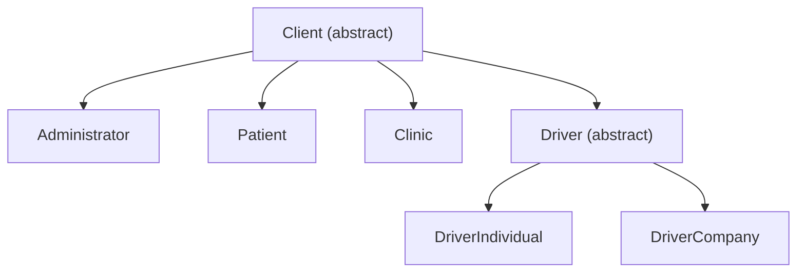

# Zentra Flow

O **Zentra Flow** é uma plataforma de gestão integrada de agendamentos médicos e transporte de pacientes. O sistema conecta Pacientes, Clínicas, Motoristas e Administradores numa jornada única, onde o paciente agenda um procedimento e, opcionalmente, garante seu transporte (ida e volta) no mesmo fluxo.

Este repositório contém o **backend** da plataforma.

---

## 🛠️ Tecnologias Utilizadas

> ### Stack Principal (Linguagem e Framework)
> * **Java 21**
> * **Spring Boot 3.3.5** (Web, Data JPA, Validation, Security, DevTools)

> ### Autenticação e Segurança
> * **Spring Security** (autenticação stateless via JWT)
> * **JJWT** (geração e assinatura de tokens, HS256)
> * **BCrypt** (hash de senhas)

> ### Banco de Dados e Migrações
> * **PostgreSQL 15** (banco relacional principal, rodando via container)
> * **H2** (banco em memória para testes)
> * **Flyway** (versionamento e controle automático de migrações SQL)

> ### Infraestrutura e Produtividade
> * **Docker & Docker Compose** (ambientes de banco de dev e prod isolados)
> * **Lombok** (redução de boilerplate)

> ### Testes
> * **JUnit 5** + **Mockito** + **AssertJ** (testes unitários)

> ### Sistema de Logs
> * **SLF4J / Logback** (logs estruturados com suporte a MDC para correlação de requisições)

---

## 🏗️ Arquitetura

O projeto segue uma organização por **domínio** (bounded contexts), não por camada técnica genérica — cada módulo de negócio concentra suas próprias entidades, regras de aplicação, acesso a dados e endpoints:

```text
src/main/java/com/zentra/zentra_flow/
│
├── identity/                  # Autenticação, autorização e perfis de usuário
│   ├── domain/                #   Entidades e regras de negócio (Client, Role, etc.)
│   ├── application/           #   Casos de uso (AuthenticationService, TokenService)
│   ├── infrastructure/        #   Acesso a dados (ClientRepository)
│   └── api/                   #   Controllers e DTOs (AuthController)
│
├── audit/                      # Auditoria de segurança (transversal a todos os módulos)
│   ├── domain/                #   AuditLog
│   ├── application/           #   SecurityAuditLogger
│   └── infrastructure/        #   AuditLogRepository
│
├── config/                     # Configurações globais (Security, JPA Auditing)
└── filter/                     # Filtros de requisição (correlação de logs via traceId)
```

Dentro de cada módulo, a regra de dependência segue **Clean Architecture**: `domain` não depende de nenhuma tecnologia externa (Spring, JPA); `application` orquestra os casos de uso; `infrastructure` implementa o acesso a dados; `api` expõe a camada HTTP.

---

## 👤 Modelo de Usuários (Identity)

Todo usuário do sistema é um `Client` — uma classe abstrata que concentra autenticação (e-mail, senha, controle de tentativas de login) e é especializada em quatro perfis concretos:



- **Administrator** — gestão global da plataforma.
- **Patient** — paciente, com histórico médico e endereço.
- **Clinic** — pessoa jurídica, precisa de aprovação administrativa (`ApprovalStatus`) antes de operar.
- **Driver** — motorista, dividido em **Individual** (pessoa física, CNH própria) e **Company** (pessoa jurídica, frota).

Documentos (CPF/CNPJ) e endereços são modelados como objetos de valor (`Document`, `Adress`) embutidos diretamente no `Client` e subtipos, evitando duplicação de campos entre pessoa física e jurídica.

A estratégia de herança usada é `JOINED`: cada subtipo concreto tem sua própria tabela, ligada por chave estrangeira à tabela do nível imediatamente acima (`clients` → `drivers` → `drivers_individual`/`drivers_company`, por exemplo).

---

## 🔐 Autenticação

- `POST /api/auth/login` — autentica por e-mail e senha, retorna um JWT.
- Contas são bloqueadas temporariamente após 5 tentativas de login incorretas (configurável).
- Toda tentativa de login (sucesso, falha, bloqueio) é registrada de forma resiliente na tabela de auditoria — mesmo em caso de erro, o registro do evento é persistido em transação independente.
- Rotas sob `/api/auth/**` são públicas; todas as demais exigem autenticação (sessão stateless, sem uso de cookies).

---

## 🔒 Security Audit Logger

Mecanismo centralizado para rastreamento de ações críticas (tentativas de login, alterações de conta, etc.):

- **Rastreio de ponta a ponta**: um filtro HTTP associa um `traceId` único a cada requisição, propagado via MDC do Logback.
- **Resiliência a falhas**: o registro de auditoria roda em transação própria (`REQUIRES_NEW`), garantindo que ele não seja perdido caso a operação que o originou sofra rollback.

### Estrutura da tabela `audit_log`

| Coluna | Tipo | Descrição |
| :--- | :--- | :--- |
| `id` | `UUID` (PK) | Identificador único do registro. |
| `action` | `VARCHAR` | Tipo de evento (ex: `LOGIN_SUCCESS`, `LOGIN_FAILED`, `ACCOUNT_LOCKED`). |
| `description` | `TEXT` | Detalhes legíveis do evento. |
| `trace_id` | `VARCHAR` | ID de correlação da requisição, obtido do MDC. |
| `version` | `INTEGER` | Controle de concorrência otimista (Hibernate). |
| `created_date` | `TIMESTAMP` | Data/hora de criação do registro. |
| `created_by` | `VARCHAR` | Ator responsável pela ação. |
| `deleted` | `BOOLEAN` | Marcação de exclusão lógica (soft delete). |

---

## ▶️ Como Executar o Projeto Localmente

### 1. Clonar o repositório
```bash
git clone https://github.com/LuizGustavoSampaio/Zentra-Flow.git
cd Zentra-Flow
```

### 2. Configurar variáveis de ambiente
Crie um arquivo `.env` na raiz do projeto com as credenciais de banco e o segredo JWT (veja `application.yml` para as variáveis esperadas).

### 3. Subir a infraestrutura de banco de dados (Docker)
Certifique-se de que o Docker está em execução, e então:
```bash
docker compose up -d
```

### 4. Iniciar a aplicação Spring Boot
Pela IDE, execute a classe `ZentraFlowApplication`, ou via terminal:
```bash
./mvnw spring-boot:run
```
Ao iniciar, o Flyway aplica automaticamente todas as migrações pendentes em `db/migration` — não é necessário rodar nenhum script manual.

### 5. Rodar os testes
```bash
./mvnw clean test
```